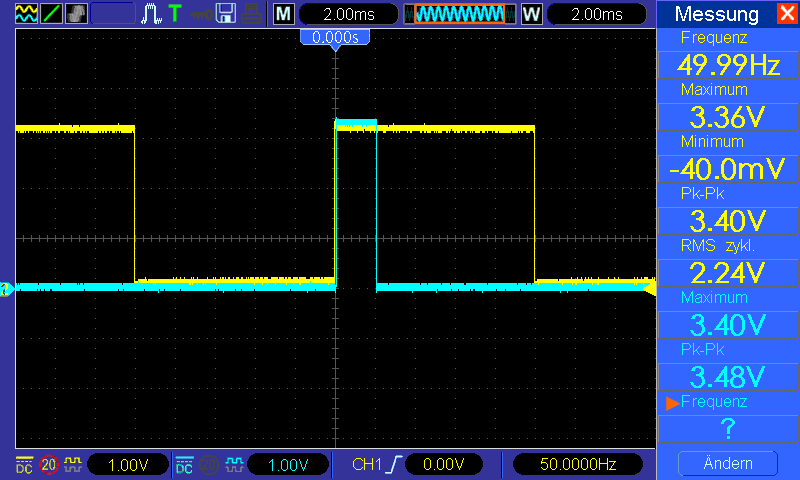
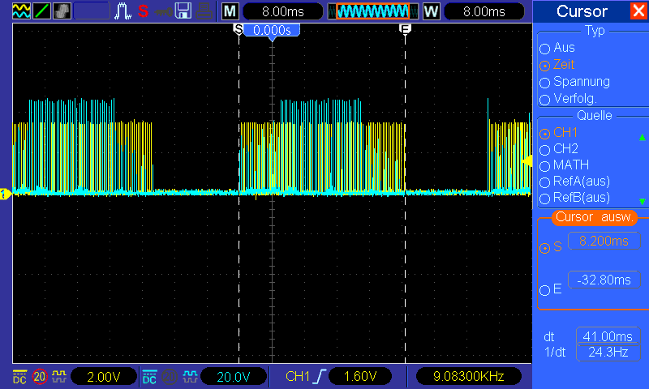
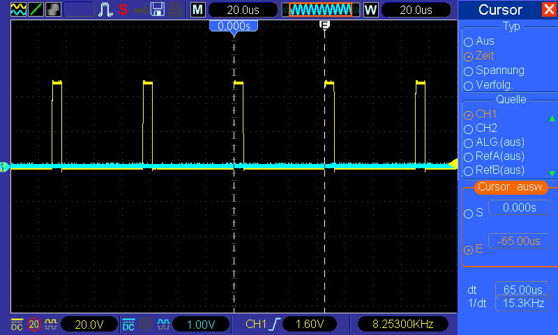
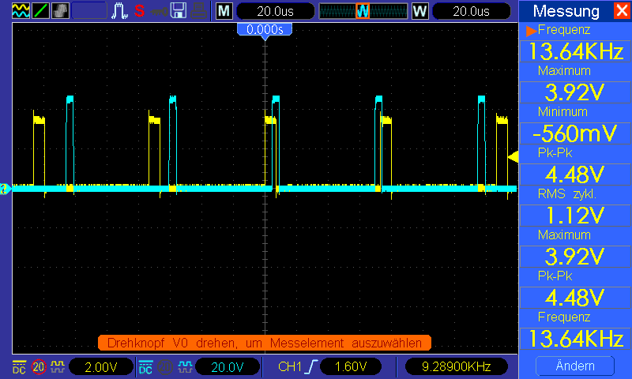

# Wiki off the intelligent motor bridge

## What is the intelligent motor bridge? Glad you asked.

The intellignet motor birdge, short the IMB is a device which sits in between the Motor controller (ESC-> for electrical speed controler) and the actual Motor.
In our case this is a 2 KW BLCD Motor <- means it's synchronised.

So firstly you should now that the interrupt must be able to trigger realy fast when a rising edge comes in.
Here we can see that the delay as mentioned before, is round about 2 µs with an ESP32 (for now i had no data with an STM32)

If you had a 50 Hz squarewave that's no problem. So I demonstrated this in the following picture:

So because we work with an BLDC-motor the ESC uses so called current chopping. The "main" frequency is still in the lower region.
Please keep in mind that with 24 Hz main frequency the motor just starts spinning. The maximum main frequency is at the time not measured (because i had no batterys that are strong enought to drive the motor at full-speed xD).
Date: 23.10.2021

In the next picture we see the frequency of the current chopping. The big problem there is that we deal here with over 15 kHz!
By a freqency of 15 kHz we have a Period of ~66.7 µs. And by an minimum reaction time of 2 µs we definitly loose power.

The minimum reaction delay the ISR is shown below:(here with an STM32)
NOTA: the blue graph is the ESC and the yellow one the triggered Interrupt (ISR).

